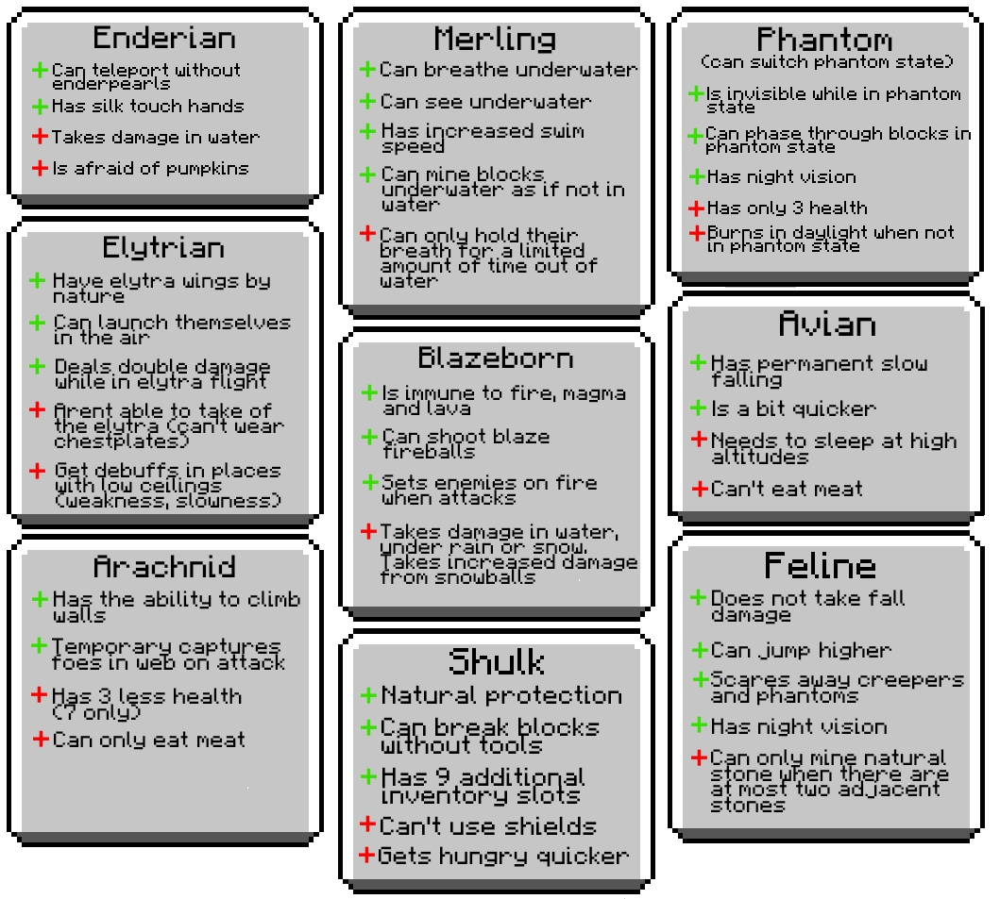

# OriginsSpigot
  
OriginsSpigot is a Bukkit/Spigot plugin that adds Origins from the Origins fabric mod to Bukkit/Spigot/Paper servers (1.13+). Currently in developement (No downloads currently avaliable). Not all of the origins are ported fully from the original mod, some of the abilities were changed due to plugins arent client-side and can't do some stuff.
## Progress
What is currently done:
- An origin management base (needs to be improved)
- The origin choosing panel and it's behaviour
- Storing data (currently using .yaml)
- Some of the origins with events and abilities 
- A repeating player state handler, to avoid using PlayerMoveEvent and optimizing player state detection

## Features
  
